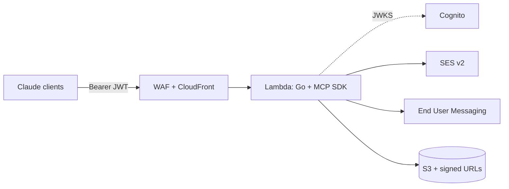

# aws-messaging-mcp

[](https://github.com/gesparza8138/aws-messaging-mcp/actions/workflows/ci.yml)
[](https://github.com/gesparza8138/aws-messaging-mcp/actions/workflows/docs.yml)

A serverless [Model Context Protocol](https://modelcontextprotocol.io) server on AWS Lambda that
lets Claude Code, Claude Desktop, and claude.ai Routines send email (Amazon SES), SMS/MMS
(AWS End User Messaging), and share files via CloudFront-signed download links.

> [!NOTE]
> **Status: M1 (auth spike) complete on dev; prod release in progress.** Tools arrive
> milestone by milestone; see the [PRD](docs/PRD.md) §16, the [plan](docs/plans/m0-m1.md),
> and [connecting clients](docs/setup/clients.md).

## Architecture (target)



Full detail: [docs/PRD.md](docs/PRD.md) §4.

## Documentation

| Doc | Purpose |
| --- | --- |
| [docs/PRD.md](docs/PRD.md) | Source of truth: scope, architecture, auth, guardrails, milestones |
| [docs/setup/github.md](docs/setup/github.md) | Repository and CI/CD configuration |
| [docs/setup/dns.md](docs/setup/dns.md) | GoDaddy → Route 53 subdomain delegation |
| [docs/setup/aws-prerequisites.md](docs/setup/aws-prerequisites.md) | SES, toll-free, RCS, Cognito prerequisites |
| [docs/plans/m0-m1.md](docs/plans/m0-m1.md) | Current implementation plan |

## Development

Requires Go (version in `go.mod`), `golangci-lint`, and [uv](https://docs.astral.sh/uv/) (only as a
runner for the IaC scanners).

```bash
make test          # go test -race with coverage gates
make lint          # gofmt + golangci-lint
make vet           # go vet
make build         # static arm64 Lambda binary in dist/
make dev           # local server on :8000
make iac-lint      # cfn-lint + checkov + cfn_nag over infra/
```

See [CONTRIBUTING.md](CONTRIBUTING.md) for conventions (Conventional Commits, signed commits,
squash-only merges).

## License

[MIT](LICENSE)
