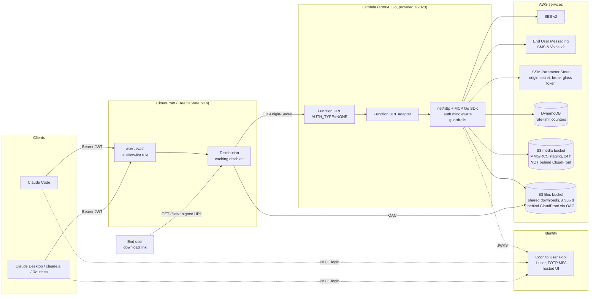
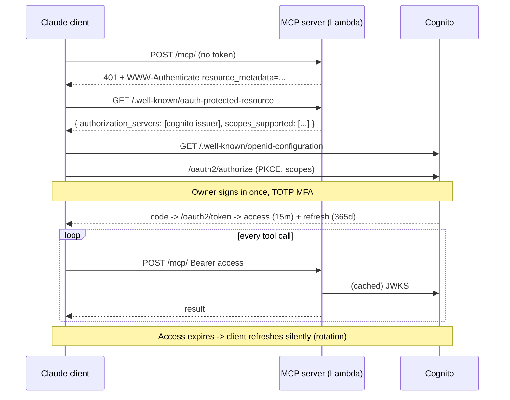
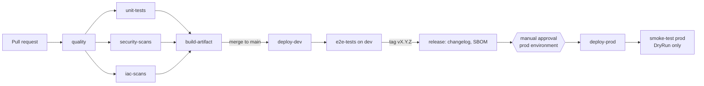
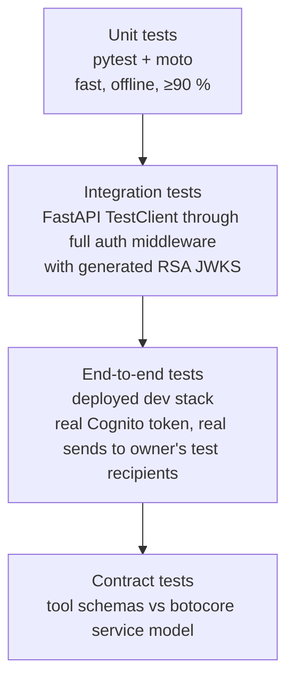

# Product Requirements Document: `aws-messaging-mcp`

A serverless MCP server on AWS Lambda that lets Claude Code and Claude Desktop send email (Amazon SES) and SMS / MMS messages (AWS End User Messaging). RCS was descoped 2026-08-23 (Appendix C).

| Field | Value |
| --- | --- |
| Status | Draft v0.4 — ready for implementation planning |
| Owner | Gabriel Esparza ([@gesparza8138](https://github.com/gesparza8138)) |
| Repository | `github.com/gesparza8138/aws-messaging-mcp` (public; no secrets, account ID, or personal numbers in the repo) |
| Last updated | 2026-08-22 |
| AWS account | Single account — ID kept out of the repo (GitHub secret `AWS_ACCOUNT_ID`); dev and prod stacks side by side |
| Target region | `us-west-2` (single region; ACM + WAF for CloudFront in `us-east-1`) |
| Hostnames | `mcp.gabriel-esparza.com` (prod), `dev.mcp.gabriel-esparza.com` (dev) — whole-domain DNS on Route 53 (registration at GoDaddy), see [`docs/setup/dns.md`](setup/dns.md) |
| Runtime | Go on AWS Lambda (`provided.al2023`, arm64) — pivoted from Python 2026-08-23, see Appendix C |

---

## Table of contents

- [1. Summary](#1-summary)
- [2. Goals and non-goals](#2-goals-and-non-goals)
- [3. Users and clients](#3-users-and-clients)
- [4. Architecture](#4-architecture)
- [5. MCP tool specification](#5-mcp-tool-specification)
- [6. Authentication and authorization](#6-authentication-and-authorization)
- [7. Security requirements](#7-security-requirements)
- [8. Server-side guardrails](#8-server-side-guardrails)
- [9. Infrastructure as Code](#9-infrastructure-as-code)
- [10. CI/CD pipeline](#10-cicd-pipeline)
- [11. Testing strategy](#11-testing-strategy)
- [12. Documentation](#12-documentation)
- [13. Observability](#13-observability)
- [14. Cost model](#14-cost-model)
- [15. Risks and open questions](#15-risks-and-open-questions)
- [16. Milestones](#16-milestones)
- [Appendix A. Repository layout](#appendix-a-repository-layout)
- [Appendix B. Client configuration](#appendix-b-client-configuration)
- [Appendix C. Decision log](#appendix-c-decision-log)

---

## 1. Summary

`aws-messaging-mcp` is a remote, stateless [Model Context Protocol](https://modelcontextprotocol.io) server exposed over Streamable HTTP. It runs as a single AWS Lambda function behind CloudFront and exposes a small set of tools that wrap two AWS services:

- **Amazon SES v2** – transactional email.
- **AWS End User Messaging (SMS & Voice v2 API)** – SMS and MMS (images). RCS is out of scope (Appendix C).
- **Amazon S3 + CloudFront signed URLs** – upload a file and get a time-limited download link (up to 365 days) to share with anyone.

The server is designed for a single owner who connects from **Claude Code**, **Claude Desktop**, and **claude.ai Routines / scheduled runs**. It must run unattended for long periods without human re-authentication, while keeping every credential in flight short-lived. Infrastructure cost at rest must be effectively zero; the only meaningful spend should be the messages themselves.

Tool parameter shapes intentionally mirror the AWS CLI / API request shapes so that an LLM's existing knowledge of `aws sesv2 send-email` and `aws pinpoint-sms-voice-v2 send-*` transfers directly to the tools.

## 2. Goals and non-goals

### Goals

| # | Goal | Success measure |
| --- | --- | --- |
| G1 | Send email, SMS, and MMS, and share files via signed download links, from any Claude client via MCP tools | All four paths verified end-to-end from Claude Code and Claude Desktop |
| G2 | Unattended operation | A Routine can call a tool ≥ 12 months after initial consent with no human re-auth |
| G3 | Short-lived credentials | No bearer credential accepted by the server lives longer than 60 minutes |
| G4 | Near-zero idle cost | Infrastructure bill ≤ $2/month excluding messaging fees |
| G5 | CLI-aligned tool schemas | Every tool's input schema is a documented subset/superset of the corresponding AWS API request shape |
| G6 | Production gate | No deploy to `prod` without passing lint, type-check, unit tests, security scans, IaC scans, and a manual approval |
| G7 | Thorough tests and docs | ≥ 90 % unit coverage, automated E2E against `dev`, GitHub-rendered docs for setup, operation, and every tool |

### Non-goals

- Receiving inbound email or SMS (no two-way messaging, no webhooks) in v1.
- Multi-tenant or multi-user authorization (one owner, one Cognito user).
- Marketing / bulk sends, templates, contact lists, or campaign management.
- Stateful MCP sessions, server-push notifications, or WebSocket transport.
- Supporting clients other than Claude surfaces (generic MCP clients should work, but are untested).

## 3. Users and clients

| Client | Transport | How it authenticates | Runs unattended? |
| --- | --- | --- | --- |
| Claude Code (interactive) | Streamable HTTP | OAuth 2.1 + PKCE via `claude mcp login`, loopback redirect on fixed port | n/a |
| Claude Code (`claude -p`, scheduled) | Streamable HTTP | Reuses stored refresh token from the interactive login | Yes |
| Claude Desktop / claude.ai / Cowork | Streamable HTTP via Anthropic's hosted connector bridge | OAuth 2.1 + PKCE, pre-registered client ID pasted into the custom connector form | Yes (bridge refreshes) |
| claude.ai Routines / scheduled tasks | Same bridge as above | Same stored connector credentials | Yes |

> [!NOTE]
> Anthropic's hosted surfaces do **not** support a machine-to-machine `client_credentials` grant; every connection requires one interactive consent. The design therefore optimises for "consent once, refresh forever" rather than "never consent".

## 4. Architecture



### 4.1 Request path

1. Client sends `POST /mcp/` with `Authorization: Bearer <Cognito access token>`.
2. **WAF** (attached to the CloudFront distribution) allows only Anthropic's published egress range `160.79.104.0/21` plus any owner-managed IP set entries (e.g. home IP for Claude Code) for the MCP path. Everything else gets `403` at the edge. Requests to `/files/*` are **exempt** from the IP rule (a scope-down statement on the URI path) because download links are meant for arbitrary end users; they are protected by the signed-URL signature instead.
3. **CloudFront** forwards the request to the Lambda Function URL with caching disabled and an injected `X-Origin-Secret` header.
4. The in-process **Function URL adapter** turns the event into an `http.Request` for the Go handler.
5. **Auth middleware** (in order): verify `X-Origin-Secret` matches SSM value → verify JWT signature against Cognito JWKS, `iss`, `client_id`, `token_use=access`, expiry → extract scopes → or, if the bearer matches the break-glass token hash, grant the configured scope set.
6. **FastMCP** dispatches the tool call. Each tool checks its required scope, runs guardrails, then calls boto3.
7. Structured log line written; response returned.

### 4.1.1 File-sharing path

1. `files_put_object` (or `files_create_upload_url` + client `PUT`) writes the object to the **files bucket** under `shared/<uuid>/<FileName>` with `x-amz-meta-expires-at`.
2. The tool signs a **CloudFront signed URL** (`https://<host>/files/shared/<uuid>/<FileName>?Expires=…&Signature=…&Key-Pair-Id=…`) with the private key from SSM and returns it.
3. An end user opens the URL; CloudFront validates the signature and expiry against the trusted key group, then fetches the object from S3 using **Origin Access Control** (the bucket is never public and has no other reader).
4. A daily scheduled handler deletes objects whose `expires-at` has passed.

> [!NOTE]
> The **files bucket** is the *only* bucket reachable through CloudFront. The **media bucket** used by MMS/RCS staging is private, has no CloudFront origin, and expires objects after 24 h. The separation is deliberate so it is always obvious what is internet-reachable.

### 4.2 Why these choices

| Choice | Alternative considered | Reason |
| --- | --- | --- |
| Lambda Function URL behind CloudFront | API Gateway HTTP API | Removes the only per-request charge and a resource; CloudFront is required anyway for the free WAF. |
| `AUTH_TYPE=NONE` + origin secret header | CloudFront OAC (IAM-signed) | OAC on Lambda URLs requires clients to send `x-amz-content-sha256` on POST, which MCP clients do not. |
| WAF rule on CloudFront | CloudFront Function IP check | Both are $0 on the Free plan; WAF IP sets are editable in the console without a deploy. |
| Cognito user pool | Static API key | Meets G2 and G3 simultaneously; static token retained only as break-glass. |
| Stateless Streamable HTTP | SSE / stateful sessions | Matches Lambda's execution model; the AWS reference sample uses the same approach. |
| Pure CloudFormation | SAM / CDK | Owner preference; avoids a transform layer and keeps the template inspectable. |

## 5. MCP tool specification

### 5.1 Design rules

1. **Mirror the AWS API.** Tool input properties use the exact PascalCase names and nesting of the underlying API request (the same shape `aws ... --cli-input-json` accepts). The LLM's prior knowledge of the CLI transfers with no translation.
2. **Server-owned fields are not parameters.** Anything the server should control for safety (`ConfigurationSetName`, `DryRun` default, origination identity when only one is allowed) is either injected or validated against an allow-list.
3. **Every send tool accepts `DryRun: bool`** (default `false`). When `true`, the server validates, runs guardrails, and returns the exact boto3 call it *would* have made without sending.
4. **Return the AWS response verbatim** (`MessageId` etc.) plus a `ServerMetadata` block (guardrail decisions, cost estimate if available). `ServerMetadata` may also carry `content_digests` — a SHA-256 and decoded byte count per binary part the server received — so a caller can verify a payload survived transit without reading the echoed bytes back.
5. **Errors are MCP tool errors, not exceptions.** boto3 `ClientError` is mapped to `isError: true` with `Code` and `Message` preserved.
6. **Read-only helper tools** exist so the model can discover valid values instead of guessing.
7. **File tools are separate from messaging media.** Nothing uploaded for MMS/RCS is ever exposed through CloudFront, and nothing in the files bucket is used by the messaging tools.

### 5.2 Tool catalogue

| Tool | Wraps | Required scope | Purpose |
| --- | --- | --- | --- |
| `ses_send_email` | `sesv2:SendEmail` | `msg/email:send` | Send a simple or raw email |
| `ses_list_email_identities` | `sesv2:ListEmailIdentities` | `msg/read` | Discover verified senders |
| `ses_get_account` | `sesv2:GetAccount` | `msg/read` | Sandbox status, send quota |
| `sms_send_text_message` | `sms-voice:SendTextMessage` | `msg/sms:send` | SMS |
| `sms_send_media_message` | `sms-voice:SendMediaMessage` | `msg/sms:send` | MMS with images |
| `sms_describe_phone_numbers` | `sms-voice:DescribePhoneNumbers` | `msg/read` | Discover origination numbers |
| `sms_get_message_status` | event-trail lookup (`logs:FilterLogEvents` on the stage's EUM event group; the API has no per-message read - M3-3) | `msg/read` | Delivery status for a `MessageId` |
| `files_put_object` | `s3:PutObject` + CloudFront URL signing | `msg/files:write` | Upload inline content, get a signed download URL |
| `files_create_upload_url` | `s3:PutObject` presigned (`aws s3 presign`-style) | `msg/files:write` | Get a short-lived `PUT` URL for large files, then sign for download |
| `files_create_signed_url` | CloudFront URL signing (`aws cloudfront sign`) | `msg/files:write` | (Re)issue a download URL for an existing key with a new expiry |
| `files_list_objects` | `s3:ListObjectsV2` | `msg/read` | List shared objects with their expiry |
| `files_delete_object` | `s3:DeleteObject` | `msg/files:write` | Revoke early by deleting the object (the URL then 403s) |

### 5.3 Tool schemas (abridged)

#### `ses_send_email`

Mirrors [`SendEmail`](https://docs.aws.amazon.com/ses/latest/APIReference-V2/API_SendEmail.html).

```jsonc
{
  "FromEmailAddress": "string (must be in allow-list)",
  "Destination": {
    "ToAddresses": ["string"],
    "CcAddresses": ["string"],
    "BccAddresses": ["string"]
  },
  "ReplyToAddresses": ["string"],
  "Content": {
    "Simple": {
      "Subject": { "Data": "string", "Charset": "UTF-8" },
      "Body": {
        "Text": { "Data": "string" },
        "Html": { "Data": "string" }
      },
      "Attachments": [ { "FileName": "string", "ContentType": "string", "RawContent": "base64",
                         "ContentDisposition": "ATTACHMENT | INLINE", "ContentId": "cid target for INLINE",
                         "ContentTransferEncoding": "BASE64 | QUOTED_PRINTABLE | SEVEN_BIT",
                         "ContentDescription": "string" } ]
    }
    // "Raw": { "Data": "base64 MIME" }  -- alternative to Simple
  },
  "EmailTags": [ { "Name": "string", "Value": "string" } ],
  "DryRun": false
}
```

Server-injected: `ConfigurationSetName` (from env) and a default `ReplyToAddresses` (`esparza.gabriel@gmail.com`, overridable) because the sender domain hosts no mailboxes. Rejected if present: `FromEmailIdentityArn`, `FeedbackForwardingEmailAddress`, `ListManagementOptions`. Exactly one of `Content.Simple` / `Content.Raw`. For `Raw`, the server parses the MIME `From` header and enforces the same sender allow-list, and rejects decoded messages larger than `EmailMaxRawBytes` (default 10 MB); the raw ladder reports as four decisions (`raw_base64`, `raw_size`, `raw_mime`, `sender_allow_list`) so a refusal names the stage that failed. `Simple` attachments spend the same `EmailMaxRawBytes` budget (combined decoded bytes, guardrails `attachment_base64` and `attachment_size`) and SES assembles the MIME itself, so `ContentDisposition: INLINE` plus a `ContentId` embeds an image the HTML body cites as `cid:<value>` without a hand-built raw message. SES's own ceiling for the assembled message is 40 MB. Both paths return `ServerMetadata.content_digests` — `{ "part": "raw" | "attachment[<i>]:<FileName>", "bytes": <decoded length>, "sha256": "<hex>" }` per binary part, identical on a `DryRun` and on the real send — so the caller can prove the bytes arrived intact before and after sending.

#### `sms_send_text_message`

Mirrors [`SendTextMessage`](https://docs.aws.amazon.com/pinpoint/latest/apireference_smsvoicev2/API_SendTextMessage.html).

```jsonc
{
  "DestinationPhoneNumber": "+1XXXXXXXXXX (E.164)",
  "OriginationIdentity": "string (phone number, pool, sender ID, or RCS agent; must be in allow-list; defaults to the single configured identity)",
  "MessageBody": "string",
  "MessageType": "TRANSACTIONAL | PROMOTIONAL",
  "MaxPrice": "string (USD, server caps at configured maximum)",
  "TimeToLive": 300,
  "Context": { "string": "string" },
  "DryRun": false
}
```

Server-injected: `ConfigurationSetName`, `ProtectConfigurationId` (if configured).

#### `sms_send_media_message`

Mirrors [`SendMediaMessage`](https://docs.aws.amazon.com/pinpoint/latest/apireference_smsvoicev2/API_SendMediaMessage.html).

```jsonc
{
  "DestinationPhoneNumber": "+1XXXXXXXXXX",
  "OriginationIdentity": "string",
  "MessageBody": "string",
  "MediaUrls": ["s3://bucket/key.jpg"],
  "MaxPrice": "string",
  "TimeToLive": 300,
  "DryRun": false
}
```

`MediaUrls` must point to the server-owned media bucket (see §8). An optional `MediaUpload` convenience field (`{ "FileName", "ContentType", "Base64Content" }`) lets the model attach an image inline; the server uploads it to the media bucket with a short lifecycle and substitutes the `s3://` URL before calling the API.

#### `files_put_object`

Mirrors [`PutObject`](https://docs.aws.amazon.com/AmazonS3/latest/API/API_PutObject.html) for the upload half and [`aws cloudfront sign`](https://docs.aws.amazon.com/cli/latest/reference/cloudfront/sign.html) for the link half. `Bucket` is **not** a parameter — the server owns the files bucket.

```jsonc
{
  "Key": "string (optional; server prefixes with shared/<uuid>/ — defaults to FileName)",
  "FileName": "report.pdf",
  "ContentType": "application/pdf",
  "Body": "string (UTF-8 text) or base64 when ContentEncoding is 'base64'",
  "ContentEncoding": "base64 | identity",
  "ContentDisposition": "attachment | inline (default attachment)",
  "Metadata": { "string": "string" },
  "ExpiresIn": "P3D  (ISO-8601 duration) — or —",
  "DateLessThan": "2026-09-30T00:00:00Z (absolute, aws cloudfront sign style)",
  "DryRun": false
}
```

Returns `{ "Key", "Bucket", "ETag", "SizeBytes", "SignedUrl", "ExpiresAt", "ServerMetadata" }`.

Rules: exactly one of `ExpiresIn` / `DateLessThan`; maximum 365 days (stack parameter `FilesMaxExpiryDays`); inline `Body` ≤ 4 MB decoded (MCP message size); content types from a deny-list (no `text/html`, no executables) unless `AllowRiskyContentTypes=true` in `dev`.

#### `files_create_upload_url`

For files too large to send inline. Returns an S3 presigned `PUT` URL (15-minute validity, bound to `ContentType` and `ContentLength`) that Claude Code can use with `curl -T`. The object is not shareable until `files_create_signed_url` is called for it.

```jsonc
{
  "FileName": "video.mp4",
  "ContentType": "video/mp4",
  "ContentLength": 52428800,
  "ExpiresIn": "P7D"
}
```

Returns `{ "Key", "UploadUrl", "UploadExpiresAt", "RequiredHeaders": { "Content-Type": "...", "Content-Length": "..." }, "NextStep": "files_create_signed_url" }`. Max `ContentLength` 500 MB (stack parameter).

#### `files_create_signed_url`

```jsonc
{
  "Key": "shared/<uuid>/video.mp4",
  "ExpiresIn": "P30D",
  "DateLessThan": "2026-12-31T00:00:00Z",
  "IpAddress": "203.0.113.0/24 (optional, custom policy)"
}
```

Returns `{ "SignedUrl", "ExpiresAt", "PolicyType": "canned | custom" }`. Re-signing updates `x-amz-meta-expires-at` to the later of the existing and new expiry so the cleanup job does not delete an object that still has a live link.

## 6. Authentication and authorization

### 6.1 Requirements

| ID | Requirement |
| --- | --- |
| A1 | Primary auth is OAuth 2.1 authorization-code + PKCE (S256) against an Amazon Cognito user pool. |
| A2 | Access tokens expire in **15 minutes**; refresh tokens expire in **365 days** with **refresh-token rotation** enabled. |
| A3 | MFA (TOTP) is required on the single Cognito user. SMS MFA is disabled (cost, SIM-swap risk). |
| A4 | The MCP server is an OAuth resource server: unauthenticated requests return `401` with `WWW-Authenticate: Bearer resource_metadata="https://<host>/.well-known/oauth-protected-resource"`. |
| A5 | The server serves RFC 9728 protected-resource metadata at `/.well-known/oauth-protected-resource` (and the path-suffixed variant) listing the Cognito issuer and `scopes_supported`. |
| A6 | Scopes are defined on a Cognito resource server named `msg`: `msg/read`, `msg/email:send`, `msg/sms:send`, `msg/files:write` (plus a dormant `msg/rcs:send` kept defined so existing consents keep refreshing; no tool accepts it). Each tool enforces its scope. |
| A7 | A **break-glass static bearer token** may be enabled per stage. It is stored as a SHA-256 hash in SSM Parameter Store, compared in constant time, and grants a configurable scope set. It is disabled by default in `prod`. |
| A8 | All accepted tokens are validated for signature (RS256, Cognito JWKS, cached ≤ 1 h), `iss`, `client_id` ∈ allowed app clients, `token_use == "access"`, and `exp`. |
| A9 | The origin-secret header is validated before any token work so that traffic bypassing CloudFront is rejected cheaply. |
| A10 | Download links are **CloudFront signed URLs** (RSA-SHA1 canned or custom policy) verified at the edge against a trusted key group; the signing private key lives in SSM SecureString and never leaves the Lambda. Signed URLs carry no Cognito token and require no MCP authentication to consume. |

### 6.2 OAuth client registration

Cognito does not support Dynamic Client Registration or CIMD, so both Claude clients use **pre-registered** app clients.

| App client | Type | Callback URLs | Used by |
| --- | --- | --- | --- |
| `claude-hosted` | Public, PKCE | `https://claude.ai/api/mcp/auth_callback`, `https://claude.com/api/mcp/auth_callback` | Claude Desktop, claude.ai, Cowork, Routines |
| `claude-code` | Public, PKCE | `http://localhost:8765/callback`, `http://127.0.0.1:8765/callback` | Claude Code with `--callback-port 8765` |

Both clients: `AllowedOAuthFlows: [code]`, `AllowedOAuthScopes: [openid, msg/read, msg/email:send, msg/sms:send, msg/rcs:send, msg/files:write]`, `EnableTokenRevocation: true`, `PreventUserExistenceErrors: ENABLED`.

> [!WARNING]
> Cognito matches redirect URIs exactly and does not ignore the loopback port, so Claude Code **must** be added with `--callback-port 8765` (or whichever port is registered).

### 6.3 Sequence



### 6.4 Token refresh and unattended operation

- Anthropic's bridge refreshes reactively on `401` and proactively ~5 min before expiry; Claude Code does the same and retries once.
- Cognito returns RFC 6749-compliant `invalid_grant` on a dead refresh token, which is what the clients need to surface "re-authenticate".
- **Recovery runbook** if a Routine fails with 401 after a refresh failure: (1) re-consent from Claude Desktop; or (2) temporarily enable the break-glass token on the affected connector via `static_headers`, then revoke it once OAuth is re-established. Both are documented in `docs/runbooks/auth-recovery.md`.

### 6.5 Future options (not in v1)

- **`headersHelper` + SigV4 token exchange** for Claude Code: a tiny Function URL with `AUTH_TYPE=AWS_IAM` mints a 1-hour JWT from the developer's local AWS credentials, removing even the refresh token from the laptop.
- Multi-user support by adding Cognito users/groups and mapping groups to scopes.

## 7. Security requirements

| ID | Requirement |
| --- | --- |
| S1 | Lambda execution role is least-privilege: `ses:SendEmail` with `Condition: StringEquals ses:FromAddress ∈ allow-list`; `sms-voice:Send*` restricted to configured origination identity ARNs; `ssm:GetParameter` on the stack's prefix; `dynamodb` on the counters table; `s3:PutObject/GetObject` on the media bucket prefix; `s3:PutObject/GetObject/DeleteObject/ListBucket` on the files bucket `shared/` prefix. No wildcard resources. |
| S2 | No secrets in code, env vars, or the template. Origin secret and break-glass hash live in SSM SecureString (KMS default key). CloudFormation references them via dynamic references or the Lambda reads them at cold start and caches. |
| S3 | GitHub Actions authenticates to AWS with **OIDC** federation (`AWS::IAM::OIDCProvider` + role per stage with `sub` condition on repo and branch/environment). No long-lived AWS keys anywhere. |
| S4 | WAF IP allow-list is default-deny; IP set is owner-editable in console but also tracked in the template (drift is reported, not auto-reverted). |
| S5 | Logs never contain message bodies, email HTML, media content, or full tokens. Recipients are logged as hashed or last-4 values in `prod`. |
| S6 | All data at rest encrypted (S3 SSE-S3, DynamoDB default encryption, CloudWatch Logs default). Both buckets block all public access. Media bucket has no CloudFront origin and expires objects after 24 h. Files bucket is readable only by the CloudFront OAC principal (bucket policy `Condition: AWS:SourceArn = distribution ARN`) and objects are deleted after their per-object expiry. |
| S11 | CloudFront signing key pair is generated offline (`scripts/rotate-signing-key.py`), public key registered via `AWS::CloudFront::PublicKey`, private key stored in SSM SecureString. Rotation adds a new key to the key group before retiring the old one so existing links keep working until they expire. |
| S12 | Files served through CloudFront get `Content-Disposition: attachment` by default and a response-headers policy with `X-Content-Type-Options: nosniff` and a restrictive CSP, so a shared file cannot execute in the browser under the MCP host's origin. |
| S7 | Dependencies pinned via `uv.lock`; `pip-audit` and Dependabot alerts block merge on known CVEs of high/critical severity. |
| S8 | Lambda has a reserved concurrency cap (e.g. 5) and a 30 s timeout to bound blast radius. |
| S9 | CloudTrail (management events) enabled; SES and EUM event destinations feed a CloudWatch log group for audit. |
| S10 | `prod` stage disables the break-glass token by default and requires a deliberate parameter change (and therefore an approved pipeline run) to enable it. |

## 8. Server-side guardrails

These run for every send tool regardless of which client or token is calling. They are the cost control as much as the safety control.

| Guardrail | Default (`dev`) | Default (`prod`) | Configured via |
| --- | --- | --- | --- |
| Sender allow-list (SES `FromEmailAddress`, EUM `OriginationIdentity`) | enforced | enforced | stack parameters |
| Recipient allow-list ("test mode") | **on** – only owner's test addresses/numbers | off | stack parameter `RecipientAllowList` |
| Per-tool rate limit (sliding window, DynamoDB counters) | 20 / hour | 60 / hour, 300 / day | stack parameters |
| Max recipients per email | 10 | 10 | stack parameter |
| Email attachments: valid base64 + combined decoded size (shares the `Content.Raw` budget) | ≤ 10 MB | ≤ 10 MB | `EMAIL_MAX_RAW_BYTES` |
| `MaxPrice` ceiling for SMS/MMS | $0.05 | $0.05 | stack parameter |
| `DryRun` | available | available | per call |
| Media size / type | ≤ 5 MB, jpeg/png/gif | same | code constants |
| Budget alarm | $10 / month on SES + EUM | $25 / month | `AWS::Budgets::Budget` |
| Files: max link expiry | 365 days | 365 days | `FilesMaxExpiryDays` |
| Files: max object size | 500 MB (presigned), 4 MB (inline) | same | stack parameters |
| Files: content-type deny-list | enforced (HTML, scripts, executables) | enforced | code constants |
| Files: bucket size cap | 5 GB total; `files_put_object` refuses above cap | 20 GB | `FilesBucketQuotaBytes` (checked via CloudWatch `BucketSizeBytes`) |

Guardrail decisions are returned in `ServerMetadata.guardrails` so the model can explain a refusal rather than retry blindly.

## 9. Infrastructure as Code

Pure CloudFormation (YAML), no SAM transform, no CDK. Deployed with `aws cloudformation deploy` from GitHub Actions. One stack per stage (`aws-messaging-mcp-dev`, `aws-messaging-mcp-prod`) in a single AWS account, plus one bootstrap stack.

### 9.1 Stacks

| Stack | Template | Contents | Deploy cadence |
| --- | --- | --- | --- |
| `bootstrap` | `infra/bootstrap.yaml` | GitHub OIDC provider, deploy roles (dev, prod), artifact S3 bucket, CloudFormation service role | Manually, once |
| `edge` (us-east-1) | `infra/edge.yaml` | Route 53 hosted zone `mcp.gabriel-esparza.com` (one, shared by stages), ACM certificate for `mcp.gabriel-esparza.com` + `*.mcp.gabriel-esparza.com` (DNS-validated, CloudFront requires us-east-1), WAF WebACL (scope `CLOUDFRONT`) + IP set | Once, rarely changes |
| `app` (us-west-2) | `infra/app.yaml` | Everything else (below) | Every merge / release |

### 9.2 `app.yaml` resource inventory

| Logical ID | Type | Notes |
| --- | --- | --- |
| `UserPool` | `AWS::Cognito::UserPool` | Essentials tier, TOTP MFA required, self-signup off, deletion protection on in prod |
| `UserPoolDomain` | `AWS::Cognito::UserPoolDomain` | Prefix domain (free); custom domain optional later |
| `ResourceServer` | `AWS::Cognito::UserPoolResourceServer` | Identifier `msg`, scopes `read`, `email:send`, `sms:send`, `rcs:send` |
| `ClaudeHostedClient`, `ClaudeCodeClient` | `AWS::Cognito::UserPoolClient` | Public clients, PKCE, token validity 15 m / 365 d, refresh rotation |
| `McpFunction` | `AWS::Lambda::Function` | arm64, Python 3.13, 512 MB, 30 s, reserved concurrency 5, Lambda Web Adapter layer, code from artifact bucket (`CodeSha256`-keyed) |
| `McpFunctionUrl` | `AWS::Lambda::Url` | `AuthType: NONE`, `InvokeMode: BUFFERED` |
| `McpFunctionUrlPermission` | `AWS::Lambda::Permission` | `lambda:InvokeFunctionUrl` for `*` with `FunctionUrlAuthType: NONE` (origin-secret check is in app) |
| `ExecutionRole` | `AWS::IAM::Role` | See S1 |
| `DnsRecords` | `AWS::Route53::RecordSet` ×2 | A/AAAA alias for the stage hostname → distribution |
| `Distribution` | `AWS::CloudFront::Distribution` | Default behavior → Function URL origin (CachingDisabled, AllViewerExceptHostHeader, `OriginCustomHeaders: X-Origin-Secret`). Second behavior `/files/*` → `FilesBucket` S3 origin via OAC, `TrustedKeyGroups: [SigningKeyGroup]`, `CachingOptimized`, GET/HEAD only, response-headers policy. `WebACLId` from edge stack; alternate domain + ACM cert |
| `RateLimitTable` | `AWS::DynamoDB::Table` | On-demand, TTL attribute, PK = `tool#window` |
| `MediaBucket` | `AWS::S3::Bucket` | Block public access, SSE-S3, 1-day lifecycle expiry, **no CloudFront origin** |
| `FilesBucket` | `AWS::S3::Bucket` | Block public access, SSE-S3, versioning off, CORS for presigned `PUT` from localhost, abort-incomplete-multipart after 1 day |
| `FilesBucketPolicy` | `AWS::S3::BucketPolicy` | `s3:GetObject` only for `cloudfront.amazonaws.com` with `AWS:SourceArn` = distribution |
| `FilesOAC` | `AWS::CloudFront::OriginAccessControl` | S3 origin, sigv4, always sign |
| `SigningPublicKey`, `SigningKeyGroup` | `AWS::CloudFront::PublicKey`, `AWS::CloudFront::KeyGroup` | Trusted key group for signed URLs; public key PEM passed as a parameter |
| `FilesResponseHeadersPolicy` | `AWS::CloudFront::ResponseHeadersPolicy` | nosniff, CSP, no-store |
| `SigningPrivateKeyParam` | `AWS::SSM::Parameter` | Placeholder; value set by rotation script |
| `FilesCleanupSchedule` | `AWS::Scheduler::Schedule` | Daily, invokes `McpFunction` with `{"task":"files-cleanup"}` to delete objects past `expires-at` |
| *(SSM secrets)* | — | `/messaging-mcp/<stage>/origin-secret` (SecureString) and `/messaging-mcp/<stage>/break-glass-sha256` are created and rotated out-of-band by `cmd/ops rotate-secret`, not by the template; the deploy workflows pass them as NoEcho parameters |
| `SesConfigurationSet` + `EventDestination` | `AWS::SES::ConfigurationSet*` | Delivery/bounce/complaint events → CloudWatch Logs |
| `EumConfigurationSet` + `EventDestination` | `AWS::SMSVOICE::ConfigurationSet` (inline CloudWatch Logs destination + assumed role; CFN-native since M3 - see M3-1) | All text/media events → CloudWatch Logs |
| `MediaBucket` | `AWS::S3::Bucket` | MMS media staging: private, never behind CloudFront, 7-day lifecycle, EUM read via SourceAccount-conditioned policy |
| `LogGroup` | `AWS::Logs::LogGroup` | 14-day retention (dev), 90-day (prod) |
| `Alarms` | `AWS::CloudWatch::Alarm` ×3 | Lambda errors, throttles, 4xx rate from CloudFront |
| `Budget` | `AWS::Budgets::Budget` | Monthly cost alarm on SES + EUM, SNS email notification |
| `Dashboard` | `AWS::CloudWatch::Dashboard` | Sends per tool, errors, p95 latency |

### 9.3 Manual / one-time prerequisites (documented, not in CFN)

- Verify SES sender identity(ies) and request production access (exit sandbox) for `prod`.
- Request a toll-free number (or 10DLC), complete registration, enable SMS + MMS.
- Create the single Cognito user and enrol TOTP (`go run ./cmd/ops bootstrap-user`).
- Enrol the CloudFront distribution in the Free flat-rate plan (console action at time of writing).
- Populate the two SSM secure parameters.
- Add the four `NS` records for `mcp` at GoDaddy after the `edge` stack outputs the hosted zone's name servers ([`docs/setup/dns.md`](setup/dns.md)). Adding DKIM CNAMEs at GoDaddy is required only if `prod` sends from `@gabriel-esparza.com`.
- Generate the CloudFront signing key pair (`scripts/rotate-signing-key.py`) and pass the public key PEM as a stack parameter.

### 9.4 Template quality gates

`cfn-lint` (with `cfn-lint-serverless` rules), `checkov` (CloudFormation framework), and `cfn_nag` run on every PR; any `HIGH`/`CRITICAL` finding fails the build unless suppressed inline with a justification comment that is itself reviewed.

## 10. CI/CD pipeline

GitHub Actions, OIDC to AWS, two stages. `dev` deploys automatically from every merge to `main`; `prod` deploys from a tagged release after a manual approval on the `prod` GitHub Environment.



### 10.1 Jobs and checks

| Job | Tooling | Gate |
| --- | --- | --- |
| `quality` | `gofmt`, `go vet`, `golangci-lint`, `pre-commit run --all-files` | must pass |
| `unit-tests` | `go test -race` with `-coverpkg=./internal/...`; fakes behind interfaces for AWS | ≥ 90 % statement coverage, 100 % on `internal/auth/` and `internal/guardrails/` |
| `security-scans` | `gosec`, `govulncheck`, `gitleaks`, GitHub CodeQL (go), GitHub dependency-review action | no high/critical |
| `iac-scans` | `cfn-lint`, `checkov -d infra/`, `cfn_nag_scan` | no high/critical |
| `build-artifact` | `CGO_ENABLED=0 GOOS=linux GOARCH=arm64 go build -trimpath` → zip `bootstrap` → upload to artifact bucket keyed by content hash | reproducible hash |
| `deploy-dev` | `aws cloudformation deploy --template-file infra/app.yaml --parameter-overrides Stage=dev CodeKey=...` with change-set review logged | stack `UPDATE_COMPLETE` |
| `e2e-tests` | `go test -tags e2e ./e2e/` against the dev URL; token via the Cognito `client_credentials` grant on the dev-only confidential `ci` client (scopes `msg/read` + `msg/email:send`) | must pass |
| `release` | `git-cliff` changelog, GitHub Release with artifact + SBOM | on `v*` tag |
| `deploy-prod` | same as dev, `Stage=prod`, GitHub Environment `prod` with required reviewer (owner) and wait timer | approval + success |
| `smoke-test` | `DryRun: true` calls for each tool via the hosted-client path | must pass; auto-rollback via `--disable-rollback false` on failure |

### 10.2 Branch and repo policy

Configured once via `scripts/setup-github.sh`; full walkthrough in [`docs/setup/github.md`](setup/github.md).

- `main` is protected by a **ruleset**: PR required, six required status checks (`quality`, `unit-tests`, `security-scans`, `iac-scans`, `docs`, `commitlint`), linear history, squash-only, signed commits, no bypass actors.
- Release tags `v*` are protected by a ruleset (no delete/update; admin bypass only).
- GitHub Environments `dev` (auto) and `prod` (required reviewer = owner, 5-minute wait, deployable only from `v*` tags). The AWS prod role's OIDC trust is scoped to `environment:prod`, so the approval gate is also the AWS boundary.
- Secret scanning with push protection, Dependabot alerts/updates, CodeQL default setup, and private vulnerability reporting enabled.
- Actions restricted to GitHub-owned, verified, and an explicit allow-list of third-party actions; default `GITHUB_TOKEN` is read-only.
- Conventional Commits enforced by `commitlint` in `pre-commit` and CI.
- Dependabot weekly for pip and GitHub Actions; Actions pinned to commit SHAs.
- `CODEOWNERS` = owner for `infra/` and `src/auth/`.
- Secrets in GitHub: none. AWS access is OIDC; the e2e client credentials live in SSM (`/messaging-mcp/dev/ci-client-{id,secret}`), read by the dev deploy role at run time.

### 10.3 Rollback

CloudFormation rollback on failed deploy is automatic. For a bad-but-successful deploy, `scripts/rollback.sh <previous-release-tag>` re-runs `deploy-prod` with the previous artifact key (artifacts are immutable and retained 90 days).

## 11. Testing strategy



### 11.1 Unit tests (`tests/unit`)

- One module per tool: parameter validation, allow-list enforcement, DryRun behaviour, error mapping from `ClientError`.
- `auth/`: JWT validation matrix (bad sig, wrong iss, wrong client_id, expired, wrong token_use, missing scope), origin-secret check, break-glass path, constant-time compare.
- `guardrails/`: rate-limit window math with frozen time, recipient allow-list, media validation.
- `tools/files.py`: key generation, expiry parsing (ISO-8601 duration and absolute), 365-day cap, signed-URL construction verified against a known-answer vector from `aws cloudfront sign`, content-type deny-list, cleanup handler with frozen time.
- Target ≥ 90 % overall, 100 % for `auth/` and `guardrails/`; enforced by `--cov-fail-under`.

### 11.2 Integration tests (`tests/integration`)

- Spin up the FastAPI app in-process with a test JWKS (generated RSA key); exercise the MCP protocol via the official `mcp` Python client over Streamable HTTP: `initialize`, `tools/list`, `tools/call`.
- Verify the `401` + `WWW-Authenticate` shape and the `/.well-known/oauth-protected-resource` document byte-for-byte against the spec.
- AWS clients are interfaces (`internal/awsclients`) with hand-rolled fakes in tests; no live AWS calls below the e2e tier.

### 11.3 End-to-end tests (`tests/e2e`)

- Run in CI as the `e2e-dev` job of every executed `deploy-dev` run, and locally via `make e2e` (see [`docs/testing.md`](testing.md)). The job admits the runner's IP to the edge allow-list for the duration of the run and withdraws it in an `always()` step (R7).
- Authenticate machine-to-machine with the Cognito **`client_credentials`** grant on the dev-only confidential `ci` client (scopes `msg/read` + `msg/email:send`). A CI *user* cannot work: `InitiateAuth` access tokens carry only `aws.cognito.signin.user.admin` — never resource-server scopes — and the pool's required TOTP blocks non-interactive sign-in.
- Real sends: one email to the owner's test mailbox; one SMS and one MMS to the owner's registered test device (M3). Recipient allow-list in `dev` makes it impossible for these tests to reach anyone else.
- Assert on AWS `MessageId`, then poll the SES/EUM event log group for a delivery event (bounded wait, skips rather than fails on provider delay or missing log permissions).
- Files: upload a small inline object, fetch the signed URL from a runner IP that is *not* in the WAF allow-list (proves `/files/*` is exempt), assert `200` and byte equality; tamper the signature and assert `403`; call with an expiry in the past and assert `403`; presigned `PUT` round-trip with a 10 MB file; `files_delete_object` then assert `403`.
- Negative E2E: request from a non-allow-listed IP (runner IP not in WAF set) is expected to be `403` — run from a separate job with the IP set temporarily excluding the runner.

### 11.4 Contract tests (`tests/contract`)

- Reflect over the AWS SDK for Go v2 input structs (`sesv2.SendEmailInput`, `pinpointsmsvoicev2.SendTextMessageInput`, …); assert every property in each tool's JSON schema exists in the corresponding input struct with a compatible type, and that all required API members are either required in the tool or server-injected. This keeps G5 true as the AWS API evolves.

### 11.5 Local development

- `make dev` runs the server locally over HTTP with the ambient AWS credentials, so the tools can be tried from Claude Code before deploying.
- `make test`, `make lint`, `make vet`, `make build`, `make e2e`.

## 12. Documentation

All docs are GitHub-flavored Markdown in the repo, rendered by GitHub (Mermaid diagrams, `[!NOTE]` admonitions, task lists, relative links). Validated in CI by `markdownlint-cli2` and `lychee` (link checker).

| Path | Audience | Contents |
| --- | --- | --- |
| `README.md` | Everyone | What it is, architecture diagram, 5-minute quick start, badges (CI, coverage, license) |
| `docs/PRD.md` | Owner / contributors | This document |
| `docs/architecture.md` | Contributors | Deep dive: request path, auth flow, data flow, why-not-X |
| `docs/server.md` | Owner + contributors | The Lambda's three entry paths, the request pipeline, and per-tool behaviour for all 14 tools |
| `docs/cicd.md` | Owner + contributors | The pipeline: six required checks, branch protections, OIDC deploys, environment gates, where secrets live |
| `docs/infrastructure.md` | Owner + contributors | The six stacks, parameter/SSM flow, conditional-wiring conventions, flat-rate plan constraints |
| `docs/setup/aws-prerequisites.md` | Owner | SES domain identity (automated via `infra/ses-domain.yaml`), production-access request text, toll-free request + verification form answers, Cognito users, signing key, Free-plan enrolment, checklist |
| `docs/setup/github.md` | Owner | Step-by-step `gh` CLI setup: repo, security features, environments, rulesets, OIDC variables, Actions permissions; runnable as `scripts/setup-github.sh` |
| `docs/setup/dns.md` | Owner | GoDaddy → Route 53 subdomain delegation, certificate, SES sender-domain options |
| `docs/setup/deploy.md` | Owner | Bootstrap stack, OIDC, first deploy, parameters reference |
| `docs/setup/clients.md` | Owner | Claude Code (`claude mcp add …`), Claude Desktop custom connector, Routines; screenshots |
| `docs/tools/*.md` | Owner + LLM | One page per tool: description plus input/output JSON Schema, rendered from the live tool registry by `cmd/gendocs` and checked in CI for drift |
| `docs/runbooks/auth-recovery.md` | Owner | What to do when a Routine gets 401s |
| `docs/runbooks/rotate-secrets.md` | Owner | Origin secret, break-glass token, CloudFront signing key, Cognito client changes |
| `docs/files.md` | Owner | How shared links work, what is and is not behind CloudFront, revoking a link, bucket quota |
| `docs/runbooks/incident.md` | Owner | Runaway sends: disable WAF allow, set reserved concurrency 0, revoke tokens |
| `docs/testing.md` | Contributors | How each test tier works and how to run it |
| `docs/security.md` | Contributors | Threat model, controls map to §7 |
| `CONTRIBUTING.md`, `CHANGELOG.md`, `LICENSE`, `SECURITY.md` | Everyone | Standard |
| `CLAUDE.md` | Claude Code | Project conventions: hard rules (ask before any AWS deploy, no prod from local, no secrets, pure CFN, API-shaped schemas), toolchain, working style |
| `docs/kickoff-prompt.md` | Owner | The prompt used to start Claude Code on the M0+M1 plan |

Docstrings: Google style on every public function; `mkdocstrings` is **not** used to keep the docs GitHub-native.

## 13. Observability

- Structured JSON logs via `aws-lambda-powertools` Logger (`tool`, `caller_sub`, `client_id`, `scope`, `recipient_hash`, `dry_run`, `aws_message_id`, `duration_ms`, `guardrail_decisions`).
- Powertools Metrics: `SendsAttempted`, `SendsSucceeded`, `SendsBlocked` (by guardrail), `AuthFailures` (by reason), dimensioned by `Tool` and `Stage`.
- X-Ray tracing enabled on the function (free tier covers personal volume).
- Alarms → SNS → owner email: Lambda `Errors > 0` in 5 min, `AuthFailures > 20` in 5 min, budget at 80 % and 100 %.

## 14. Cost model

Assumptions: single owner, ~5,000 MCP requests/month, ~300 emails, ~200 SMS, ~50 MMS, ~50 RCS, one toll-free number, `us-west-2`, CloudFront Free flat-rate plan.

| Component | Unit price | Usage | Est. / month |
| --- | --- | --- | --- |
| Cognito (Essentials) | $0.015 / MAU after 10k free | 1–2 MAU | $0.00 |
| CloudFront Free plan (prod distribution + web ACL, TLS, CloudFront Functions) | $0 ≤ 1M req / 100 GB | 5k req | $0.00 |
| Lambda | 1M req + 400k GB-s always free | 5k req | $0.00 |
| DynamoDB on-demand | 25 GB + 2.5M reads free | trivial | $0.00 |
| S3 media bucket | 5 GB free (12 mo), then $0.023 / GB | < 100 MB | $0.00 |
| S3 files bucket (shared downloads) | $0.023 / GB-month + $0.005 / 1k PUT | ~2 GB | ~$0.05 |
| CloudFront data out for downloads | within 100 GB Free-plan allowance | ~5 GB | $0.00 |
| EventBridge Scheduler (daily cleanup) | 14M invocations free | 30 | $0.00 |
| SSM Parameter Store (standard) | free | 2 params | $0.00 |
| CloudWatch Logs / Metrics / X-Ray | free tiers | small | $0.00 |
| ACM certificate | free | 1 | $0.00 |
| Route 53 hosted zones | `mcp` zone covered by the Free plan; root zone $0.50 (one zone per plan) | 2 | $0.50 |
| Domain registration | ~$12–15 / year | 1 | ~$1.00 |
| **Infrastructure subtotal** | | | **≈ $0–1.50** |
| SES outbound | $0.10 / 1,000 | 300 | $0.03 |
| EUM toll-free number lease | ~$2 / month | 1 | $2.00 |
| SMS (US) | ~$0.009 + carrier fees | 200 | ~$2.00 |
| MMS (US) | ~$0.02–0.03 | 50 | ~$1.25 |
| **Messaging subtotal** | | | **≈ $6–7** |
| **Total** | | | **≈ $7–9 / month** |

> [!NOTE]
> Messaging rates are carrier- and registration-dependent and must be confirmed in the End User Messaging console for the chosen number type before this table is finalised. Infrastructure is free-tier by design: the server costs nothing to leave running.

## 15. Risks and open questions

| # | Risk / question | Likelihood | Impact | Mitigation |
| --- | --- | --- | --- | --- |
| R1 | Hosted bridge fails to refresh tokens (prior incident reported) | Medium | Routines stop | Break-glass token + runbook; alarm on `AuthFailures`; long refresh lifetime means failure is rare, not chronic |
| R2 | ~~Cognito discovery metadata omits `code_challenge_methods_supported`; a strict client may refuse PKCE~~ **Resolved 2026-08-22:** both Claude Code and the hosted bridge completed PKCE S256 against Cognito directly (`AuthMetadataMode=direct`); the fronted RFC 8414 document stays available as a feature flag | — | — | Flip `AuthMetadataMode=fronted` per stage if a future client regresses |
| R3 | ~~CloudFront buffering interferes with Streamable HTTP~~ **Resolved 2026-08-22:** stateless JSON responses through WAF + CloudFront + Function URL (BUFFERED) + Lambda Web Adapter verified with the `mcp` client, Claude Code, and the hosted bridge | — | — | Keep `json_response=True`, `stateless_http=True` |
| R4 | ~~`SendRcsMessage` API shape~~ Moot 2026-08-23: RCS descoped | — | — | — |
| R5 | ~~CloudFormation coverage for EUM v2 incomplete~~ **Resolved 2026-08-24:** every needed resource is CFN-native (`AWS::SMSVOICE::PhoneNumber/ConfigurationSet/ProtectConfiguration`); even the toll-free number is stack-managed (`infra/eum.yaml`, Retain + deletion protection). Only the carrier verification form remains manual | — | — | — |
| R6 | ~~RCS country launch registration delays~~ Moot 2026-08-23: RCS descoped | — | — | — |
| R7 | ~~Claude Code home IP changes break WAF allow-list~~ **Resolved 2026-08-22:** keep the default-deny IP allow-list; `scripts/update-my-ip.sh` refreshes the owner entry; CI e2e runners self-register their egress IP for the run (dev deploy role holds scoped `wafv2:UpdateIPSet`, implemented with the e2e harness in M2) | — | — | Revisit token-only access only if the IP churn becomes a nuisance |
| R8 | ~~CloudFront Free plan vs CloudFormation~~ **Resolved 2026-08-22:** CloudFormation has no plan support; enrolment is scripted via the `pricing-plan-manager` API (`scripts/enroll-pricing-plan.sh`). The Free plan covers one distribution — **prod** gets it (owner decision); dev stays pay-as-you-go and its WAF share is observed on the bill for M5 | — | — | The script was dropped in M5 (broken against newer CLIs; enrolment ran once via the `pricing-plan-manager` API and the subscription persists). If the prod distribution is ever recreated, re-subscribe via that API — see infrastructure.md |
| R9 | A long-lived (up to 365 d) signed URL leaks | Medium | Unintended download | Per-object revoke via `files_delete_object`; optional `IpAddress` custom policy; key rotation invalidates all links in an emergency; content-type deny-list |
| R10 | Large downloads exceed the Free plan's 100 GB / month | Low | Overage is blocked, not billed, on flat-rate plans — downloads fail | Bucket quota guardrail (live); `BytesDownloaded` is a dashboard widget — an alarm is impossible from us-west-2 (M5 decision log) |
| Q1 | ~~Single AWS account with two stacks, or two accounts?~~ **Resolved 2026-08-22:** one account, stack per stage | — | — | Revisit only if prod data isolation becomes a concern |
| Q2 | ~~Toll-free vs 10DLC number?~~ **Resolved 2026-08-22:** toll-free, SMS + MMS enabled, two-way disabled | — | — | 10DLC is a registration plus an `OriginationIdentity` parameter change if volume ever warrants it |
| Q3 | ~~Should `ses_send_email` support `Raw` MIME in v1?~~ **Resolved 2026-08-22:** yes | — | — | Server parses MIME headers to enforce the `From` allow-list; decoded size capped (default 10 MB, SES max 40 MB) |

## 16. Milestones

| Milestone | Scope | Exit criteria |
| --- | --- | --- |
| **M0 – Bootstrap** | Run `scripts/setup-github.sh` (repo, rulesets, environments, security features), `uv` project scaffold, pre-commit, CI quality/unit/security/IaC jobs green on an empty app, bootstrap + edge stacks deployed, OIDC role assumption verified from a workflow | PR checks enforced on `main`; `prod` deploy blocked without approval (verified by attempting one) |
| **M1 – Auth spike** | Cognito pool, `app.yaml` with hello-world tool, CloudFront + WAF, OAuth round-trip from Claude Code **and** Claude Desktop, Routine executes after token refresh | R2/R3/R7 resolved; `docs/setup/clients.md` written |
| **M2 – Email** | `ses_send_email`, `ses_*` read tools, guardrails, unit + integration + E2E, tool docs | Real email sent from both clients in `dev`; prod deploy via release flow |
| **M3 – SMS/MMS** | `sms_send_text_message`, `sms_send_media_message`, media upload path, number prerequisites doc | Real SMS + MMS from both clients; budget alarm verified |
| ~~M4 – RCS~~ | Removed 2026-08-23 (Appendix C) | — |
| **M4b – Files** | `files_*` tools, files bucket + OAC + key group + `/files/*` behavior, WAF path exemption, cleanup schedule, signing-key rotation script, `docs/files.md` | Signed link downloaded from a non-allow-listed network; expired/tampered links 403; cleanup verified |
| **M5 – Hardening** | Dashboard, runbooks, incident drill (runaway sends), secret rotation drill, docs pass | All runbooks executed once successfully |

---

## Appendix A. Repository layout

```text
aws-messaging-mcp/
├── .github/
│   ├── workflows/
│   │   ├── ci.yml              # quality, unit-tests, security-scans, iac-scans, commitlint
│   │   ├── docs.yml            # markdownlint, lychee
│   │   ├── deploy-dev.yml      # manual dispatch: build, change set, execute
│   │   ├── release.yml         # on v* tag -> GitHub Release -> approval -> prod
│   │   └── verify-oidc.yml
│   ├── dependabot.yml          # gomod + github-actions
│   └── CODEOWNERS
├── cmd/
│   ├── server/                 # Lambda bootstrap / local HTTP server
│   └── ops/                    # rotate-secret, bootstrap-user
├── internal/
│   ├── settings/               # env -> Settings, SSM origin-secret resolver
│   ├── auth/                   # origin, break-glass, JWT verifier, scopes (100 % covered)
│   ├── httpapi/                # mux, middleware, OAuth metadata documents
│   ├── mcpserver/              # MCP server + tools (hello; M2+: ses, sms, rcs, files)
│   ├── lambdaadapter/          # Function URL event <-> http.Handler (buffered)
│   ├── guardrails/             # M2+: allow-lists, rate limits, media checks
│   ├── schemas/                # M2+: tool input types mirroring AWS shapes
│   └── testkeys/               # test-only RSA/JWKS helper
├── infra/
│   ├── bootstrap.yaml, edge.yaml, root-dns.yaml, app.yaml
│   └── params/{dev,prod}.json
├── scripts/                    # setup-github.sh, update-my-ip.sh, check_coverage.sh, ...
├── docs/                       # see §12
├── go.mod, go.sum, .golangci.yml
├── Makefile
├── CLAUDE.md
└── README.md
```

## Appendix B. Client configuration

### Claude Code

```bash
claude mcp add --transport http aws-messaging https://mcp.gabriel-esparza.com/mcp/ \
  --client-id <ClaudeCodeClientId> \
  --callback-port 8765 \
  --scope user
claude mcp login aws-messaging
```

Optional scope pinning in `.mcp.json`:

```json
{
  "mcpServers": {
    "aws-messaging": {
      "type": "http",
      "url": "https://mcp.gabriel-esparza.com/mcp/",
      "oauth": { "clientId": "<ClaudeCodeClientId>", "callbackPort": 8765, "scopes": "openid msg/read msg/email:send" }
    }
  }
}
```

### Claude Desktop / claude.ai (custom connector)

Settings → Connectors → Add custom connector → URL `https://mcp.gabriel-esparza.com/mcp/`, OAuth Client ID `<ClaudeHostedClientId>`, no client secret → Connect → sign in to Cognito hosted UI with TOTP.

### Break-glass (temporary)

Claude Code: `claude mcp add --transport http aws-messaging-bg https://mcp.gabriel-esparza.com/mcp/ --header "Authorization: Bearer ${MSG_MCP_TOKEN}"`.
claude.ai: edit the connector → request headers → `Authorization: Bearer <token>` (beta feature).

## Appendix C. Decision log

| Date | Decision | Rationale |
| --- | --- | --- |
| 2026-08-24 | **M5 outcomes:** alarms are Lambda errors/throttles + DynamoDB throttles (CloudFront metrics live only in us-east-1, so 5xx and files transfer are dashboard widgets; a 4xx alarm is meaningless on a default-deny service); budget is one account-level prod resource; both drills executed on dev — containment ~2 min, and the rotation drill exposed that `AWS::CloudFront::PublicKey` rejects in-place key changes *and* has no create-only properties, hence the a/b key-slot pattern; `ReservedConcurrency=5` ships now that the quota was granted; external links check weekly, off the PR path | Drill-first hardening: both levers had defects that only pulling them revealed (#68, #69) |
| 2026-08-24 | **M4b build outcomes:** signing keys are generated into SSM by `cmd/ops rotate-signing-key` before the infra deploy (M4b-2; rotation doubles as the R9 kill-all-links lever); the scheduler's `{"task":"files-cleanup"}` payload dispatches through a Lambda task mux ahead of the HTTP adapter (M4b-1); the bucket-size quota is a lagging backstop that fails open on metric outages (M4b-3); RSA-SHA1 in URL signing is CloudFront's protocol contract, annotated for gosec (M4b-4); presigned PUT uploads go straight to S3 with the URL as the secret (M4b-5); re-signing only ever extends an object's stored expiry | Findings M4b-1..M4b-5 (`docs/plans/m4b.md` §1) |
| 2026-08-24 | **M3 build outcomes:** all EUM resources CFN-native incl. the stack-managed toll-free number (`infra/eum.yaml`, Retain); tool `DryRun` keeps the server-side M2 semantics while the API's own `DryRun` stays server-controlled; `sms_get_message_status` is an event-trail lookup; `/` and `/opt-in` are public edge-exempt pages for carrier verification; the owner's test phone reaches the dev recipient allow-list only at deploy time from the `E2E_TEST_PHONE` secret | Findings M3-1..M3-5 (`docs/plans/m3.md` §1); public-repo hygiene keeps numbers out of the repo (SSM `/messaging-mcp/eum/*`) |
| 2026-08-24 | **EUM SMS sandbox** (account tier SANDBOX, $1/month spend caps): real sends reach only verified destination numbers until production access is requested; e2e maps the sandbox refusal to a skip. Production access will be requested after the toll-free carrier verification completes | Found during M3: EUM has a per-account sandbox like SES (M3-6). The $20 spend-limit override in prerequisites §2.3 only applies once production access raises `MaxLimit` (currently $1) |
| 2026-08-23 | E2E authenticates with the Cognito **`client_credentials`** grant on the dev-only `ci` client; no CI user, no GitHub secret (client id/secret in SSM, read by the dev deploy role). Tool reference pages are generated by `cmd/gendocs` from the live tool registry with a CI drift check | The planned `USER_PASSWORD_AUTH` design cannot work: `InitiateAuth` access tokens never carry resource-server scopes, and pool-wide TOTP blocks a non-interactive user. Cognito has billed M2M per successful token request (no flat per-client fee) since 2025-11, so the grant fits the S1 budget |
| 2026-08-23 | Lambda's `ses:SendEmail` grant is `identity/*` + the `ses:FromAddress` condition, not the sending-domain identity ARN | Found by the first live e2e run: SES authorizes sandbox sends against the **recipient's** identity ARN too, so the domain-scoped grant denied sends to the verified test mailbox; the FromAddress condition is what actually pins the sender |
| 2026-08-22 | Drop SNS; use End User Messaging for all texting | SNS has no MMS/RCS; EUM covers SMS, MMS, RCS with fallback |
| 2026-08-22 | Tool schemas mirror AWS API shapes (PascalCase) | Leverage LLM familiarity with AWS CLI/API |
| 2026-08-22 | Pure CloudFormation, no SAM | Owner preference; inspectable templates |
| 2026-08-22 | Cognito OAuth primary, static token break-glass only | Meets short-lived-credential and unattended goals together |
| 2026-08-22 | CloudFront Free plan + WAF IP rule, Function URL origin | $0 edge security; console-editable IP set; no API Gateway charge |
| 2026-08-22 | GitHub Actions with OIDC, dev + prod with manual prod approval | CI/CD best practice; no static AWS keys |
| 2026-08-22 | E2E tests perform real sends to owner's recipients in `dev` | Only way to prove carrier paths; allow-list makes it safe |
| 2026-08-22 | Toolchain: uv, ruff, mypy, pytest, moto, cfn-lint, checkov, cfn_nag | Modern, fast, well-supported |
| 2026-08-22 | Add file-sharing tools backed by a dedicated S3 bucket and CloudFront signed URLs (≤ 365 d) | S3 presigned URLs cap at 7 days; CloudFront signed URLs allow arbitrary expiry at no extra cost |
| 2026-08-22 | Files bucket and messaging media bucket stay **separate** | Owner wants it always obvious which bucket is internet-reachable through CloudFront |
| 2026-08-22 | Expired objects are deleted by a daily scheduled task | Keeps the bucket bounded; per-object expiry is metadata, not a fixed lifecycle prefix |
| 2026-08-22 | Q1–Q3 resolved: single account / two stacks; toll-free number; `Raw` MIME supported in v1 | See §15 |
| 2026-08-22 | Single AWS account for both stages; delegate `mcp.gabriel-esparza.com` from GoDaddy to Route 53 rather than moving the domain | Keeps existing GoDaddy DNS/email untouched; Route 53 zone lets CloudFormation manage certs and records |
| 2026-08-22 | Email sender: `@gabriel-esparza.com` in both stages, `mcp-dev@` vs `mcp@`; DKIM at GoDaddy, MAIL FROM subdomains in Route 53; dev stays in SES sandbox | No mail hosted on the domain, so SES can own SPF/DMARC; sandbox doubles as dev recipient restriction |
| 2026-08-22 | Repository is **public**, not private; the AWS account ID and the owner's phone number are kept out of the repo and stored as GitHub **secrets** (masked in Actions logs — variables are not masked) | GitHub Free gates rulesets and environment protection rules (the prod approval gate, which is part of the AWS security boundary via OIDC `environment:prod` trust) to public repos; required reviewers on private repos need Enterprise. Public also enables secret scanning push protection and CodeQL at no cost |
| 2026-08-23 | Prod distribution + web ACL subscribed to the CloudFront **Free** flat-rate plan via `pricing-plan-manager` (plan forbids restricted price classes, so `PriceClass` is unset; the plan requires the ACL to protect only the subscribed distribution, so dev has no ACL). The `mcp` hosted zone is attached to the plan; the root zone is not eligible (one zone per Free plan) and stays pay-as-you-go at $0.50/month | Owner decision G12; cost model §14 updated |
| 2026-08-23 | **RCS descoped** (tool, milestone M4, docs, cost rows removed; SMS/MMS remain M3). The Cognito scope `msg/rcs:send` stays defined but dormant so existing client consents keep refreshing; the server no longer advertises it | Owner decision: RCS needs brand verification, per-country carrier launch registration, and weeks of review - disproportionate complexity and cost for a personal tool that SMS/MMS covers |
| 2026-08-23 | **Runtime pivot to Go** (`provided.al2023`, arm64, static `bootstrap`, official MCP Go SDK, in-house buffered Function URL adapter). Python remains only as a CI tool runner. Contract tests move from botocore to AWS SDK for Go v2 struct reflection | Cold start measured at ~2,950 ms in Python (runtime + Web Adapter + imports) versus **217 ms** in Go on the same stack, at a traffic level where nearly every call is a cold start; SnapStart/provisioned concurrency would have cost more than the G4 budget. Done before M2 while the app was ~500 lines (`docs/plans/go-pivot.md`) |
| 2026-08-23 | Edge access control moves from WAF rules to a **CloudFront Function** (viewer-request IP allow-list with the `/files/*` exemption; list in SSM, applied live by `update-my-ip.sh`); the WAF web ACL stays attached to prod only, empty, for flat-rate plan eligibility; distributions are IPv4-only | The Free plan's WAF supports only managed rules, rate limiting, and geo blocking - an IP-set allow-list or path match makes the ACL (and its distribution) ineligible, which surfaced at the first `CreateSubscription`. CloudFront Functions are included in the plan; PRD 4.2 had listed this as the alternative |
| 2026-08-22 | M1 auth spike outcomes: R2 resolved in `direct` mode (fronted metadata kept as a flag), R3 resolved, R7 = IP allow-list + `update-my-ip.sh` + CI self-registration, R8 = Free plan on **prod** via `pricing-plan-manager`; refresh proven (hosted-bridge call succeeded 17.8 min after the 15-min access token was issued); TOTP enrolment observed at first login (the per-user MFA list stays empty on MFA-required pools — API quirk, not a gap) | Spike ran against the deployed dev stack from Claude Code, Claude Desktop, and a delayed hosted call |
| 2026-08-22 | Hosted-bridge compatibility: the `claude-hosted` client registers both `claude.ai` and `claude.com` callbacks, and the server treats `/mcp` and `/mcp/` identically with redirects disabled (the bridge posts without a trailing slash and a Starlette redirect would have pointed it at the raw Function URL) | Observed in server logs during E3; both are now covered by tests |
| 2026-08-22 | **A4 deviation:** 401s carry `x-amzn-Remapped-www-authenticate`, not `WWW-Authenticate`; discovery relies on the MCP-spec client fallback to `/.well-known/oauth-protected-resource`, which the server serves. Verified empirically with each Claude client in M1 (E2/E3); Lambda@Edge origin-response is the fallback if a client requires the header | Lambda Function URLs rename the header on every response (platform behaviour, also true of API Gateway), and CloudFront Functions never run for origin responses ≥ 400, so an edge rename is impossible without Lambda@Edge (us-east-1 function, cross-region plumbing) |
| 2026-08-22 | Lambda reserved concurrency (S8) is a stack parameter defaulting to **off**; re-enable at 5 once the account's Lambda concurrency quota is raised | The account's default quota is 10 total; Lambda refuses any reservation that would leave fewer than 10 unreserved, so the first dev deploy rolled back. Quota-increase request tracked for M5 |
| 2026-08-22 | DNS hosting for the **whole domain** moves to Route 53 (`infra/root-dns.yaml`); registration stays at GoDaddy; pre-existing site/mail records carried over verbatim; the `mcp` child zone and edge stack are unchanged, with delegation records now in the root zone | Owner decision (existing uses of the domain are expendable); removes every recurring GoDaddy touchpoint and makes the M2 email-auth records (DKIM/SPF/DMARC) fully automatable |
