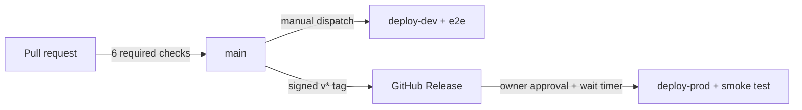

# CI/CD and the security gauntlet

Every path from a keystroke to prod, and every check standing in the way.
Companions: [server.md](server.md), [infrastructure.md](infrastructure.md),
[testing.md](testing.md).

## The shape of the pipeline

There is no path around it: `main` refuses direct pushes, releases build
only from tags, and prod deploys only through the gated environment.

## Pull-request gates (all six required)

| Check | What runs | What it catches |
| --- | --- | --- |
| `quality` | `gofmt -l`, `go vet`, `golangci-lint`, `pre-commit run --all-files` | Formatting, suspicious constructs, the linter battery (errcheck, revive, gosec-in-lint, …) |
| `unit-tests` | `go test -race -coverpkg=./internal/...` + `scripts/check_coverage.sh` | Races, regressions; **coverage floors are hard**: ≥ 90 % overall, **100 % for `internal/auth` and `internal/guardrails`** — the two packages where a missed branch is a security hole |
| `security-scans` | `gosec`, `govulncheck`, `gitleaks`, dependency-review; CodeQL (go + actions) runs via default setup | Insecure patterns, known-vulnerable dependencies, committed secrets, malicious dependency diffs |
| `iac-scans` | `cfn-lint`, `checkov`, `cfn_nag` over `infra/` | Template errors, policy/security misconfigurations; every suppression carries a written justification in the template |
| `docs` | `markdownlint-cli2`, `lychee --offline` (every relative link), `go run ./cmd/gendocs -check` | Broken docs, and **tool-reference drift**: the pages under `docs/tools/` are generated from the live tool registry, so a schema change without its doc change fails CI |
| `commitlint` | Conventional Commits | History stays machine-readable (squash-merge titles included) |

Branch protections on top: PRs required, linear history, squash-only,
**signed commits**, protected `v*` tags, no bypass actors. Secret scanning
with push protection and Dependabot run repo-side.

## Tests, in tiers

Unit (auth matrix, guardrails, adapters — fakes behind interfaces, never
live AWS), integration (the full HTTP stack in-process: OAuth and
break-glass round trips, 401/403 contracts), contract (reflection over the
AWS SDK input structs so tool schemas track the real APIs), and e2e
(the deployed dev stack through the public edge — real token, real email
with its delivery event, SMS registry/guardrails, the full files contract).
Details and how to run each: [testing.md](testing.md).

The e2e job self-registers the runner's egress IP on the edge allow-list
for the duration of the run and withdraws it in an `always()` step, so the
default-deny posture never has a standing hole.

## Deploys

- **No long-lived AWS keys anywhere.** GitHub OIDC only, with the trust
  policies pinned to *ID-embedded* subjects
  (`repo:<owner>@<owner-id>/<repo>@<repo-id>:environment:<stage>`), so even
  a renamed or recreated repo can't assume the roles.
- **Dev**: manual dispatch; `execute=false` builds the artifact
  (content-hash keyed, immutable, 90-day retention) and prints the change
  set for review; `execute=true` applies it and runs e2e. The deploy role
  can only pass the CFN service role — resource-level permissions live on
  the service role, not the CI identity.
- **Prod**: a signed `v*` tag → Release build → the `prod` GitHub
  environment (required reviewer = owner, wait timer) → deploy → smoke test
  (edge 403 from the runner is *expected* and asserted, plus origin-secret
  contracts). The prod role's OIDC trust is scoped to `environment:prod`,
  so the human approval gate is also the AWS boundary.
- **Rollback**: CloudFormation auto-rolls-back failed deploys (twice proven
  in anger — v0.4.0's headers rejection rolled back with zero downtime);
  for a bad-but-successful deploy, redeploy the previous immutable artifact.

## Where secrets live

| Kind | Where | Notes |
| --- | --- | --- |
| Origin secret, break-glass hash, files signing key, ci-client secret | SSM Parameter Store (SecureString) | Read at deploy time (NoEcho parameters) or Lambda cold start; rotated by `cmd/ops` |
| AWS account id, artifact bucket, deploy-role ARNs, owner phone | GitHub secrets | Masked in logs; the phone is merged into a stack parameter at deploy time and never enters the repo |
| In the repository | **nothing** | `gitleaks` + push protection enforce it; the repo is public by design |
