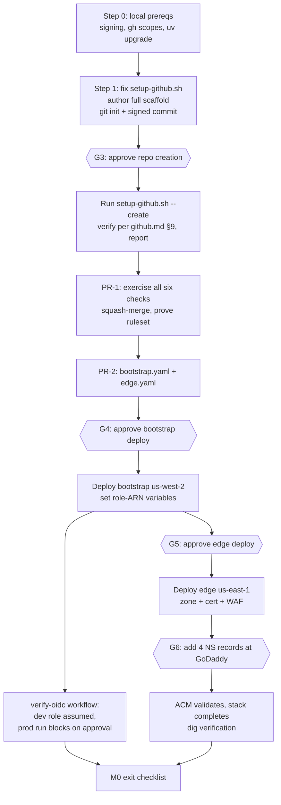

# Implementation plan: M0 (Bootstrap) + M1 (Auth spike)

| Field | Value |
| --- | --- |
| Status | Awaiting owner review — nothing has been implemented or deployed |
| Date | 2026-08-22 |
| Scope | PRD §16 milestones M0 and M1 only; M2+ deliberately unplanned |
| Inputs | `CLAUDE.md`, `docs/PRD.md` (v0.4), `docs/setup/github.md`, `docs/setup/dns.md`, `docs/setup/aws-prerequisites.md`, `scripts/setup-github.sh` |

Everything in §1 (pre-flight findings) was verified today on this machine and account unless marked otherwise. No AWS resources were created and no GitHub repository exists yet; verification used read-only calls, ephemeral local environments, and a deliberately invalid GitHub token for the one destructive-looking test.

---

## 1. Pre-flight findings and PRD corrections

The kickoff asked for anything wrong, out of date, or infeasible to be called out before starting. Findings F1–F3 change M0 step 1 itself; F4–F7 change how M1 should be planned.

### F1. `scripts/setup-github.sh --create` fails as written — **verified**

`gh repo create` rejects `--license` combined with `--source`:

```text
the `--source` option is not supported with `--clone`, `--template`, `--license`, or `--gitignore`
```

(Reproduced with `gh` 2.98.0 using a dummy token, so no repo was created.) The `--create` branch of the script (line 30) passes both. **Fix (part of M0 step 1):** remove `--license MIT` from the script's create path and instead add `LICENSE` (MIT) and a Python `.gitignore` as ordinary files in the scaffold commit. `docs/setup/github.md` §1 is unaffected (it uses the remote-create flow) but should gain a note.

### F2. Commit signing is not configured on this machine — **verified**

`git config gpg.format` and `commit.gpgsign` are both unset, and the `protect-main` ruleset requires signed commits — the very first scaffold commit must already be signed. `~/.ssh/id_ed25519.pub` exists, so the setup is exactly the one-liner from `docs/setup/github.md` §4.1:

```bash
gh ssh-key add ~/.ssh/id_ed25519.pub --type signing
git config --global gpg.format ssh
git config --global user.signingkey ~/.ssh/id_ed25519.pub
git config --global commit.gpgsign true
```

I can run this with your OK (it registers the key with GitHub and changes global git config).

### F3. `gh` token scopes are narrower than `docs/setup/github.md` §0 expects — **verified**

Current auth: account `gesparza8138`, scopes `repo, read:org, gist, admin:public_key`, git over SSH. The docs call for `gh auth refresh -s repo,workflow,admin:org,admin:repo_hook,read:org`. Because git pushes go over SSH, the missing `workflow` scope probably does not block pushing workflow files, but running the refresh first removes a class of mid-script `403`s. One-time interactive step (browser prompt) — listed as gate G2 below.

### F4. `SendRcsMessage` exists, but its shape differs from PRD §5.3 — **verified against botocore**

Checked against boto3 **1.43.78** (PRD's `>= 1.43.37` floor is satisfiable; note the local `uv` cache served boto3 1.37.34 — which lacks RCS entirely — until `--refresh` was forced, so the lockfile must pin the floor). Deltas from the PRD sketch:

| PRD §5.3 says | Actual API |
| --- | --- |
| `Message` | `RcsMessageContent` with a required inner `Content` structure |
| `Message.Text.Suggestions` | `Suggestions` sits at the `RcsMessageContent` level, beside `Content`, not inside `Text` |
| content variants | `Content.TextMessage{Body}`, `Content.FileMessage{FileUrl, ThumbnailUrl}`, `Content.RichCard`, `Content.Carousel` |
| `Fallback` | `FallbackConfiguration`, with a **required `Channel` member (`SMS` \| `MMS`)** plus `MessageBody`, `MediaUrls`, `OriginationIdentity` |
| — | Additional top-level members the PRD doesn't mention: `MessageTrafficType`, `ProtectConfigurationId`, `ConfigurationSetName`, `MaxPrice`, `Context`, `MessageFeedbackEnabled`, and a **native API-level `DryRun`** |

Also confirmed: `DescribeRcsAgents` exists (the PRD's "name to confirm" is resolved), `DescribeRcsAgentCountryLaunchStatus` exists for M4, and there is **no** `GetMessage`-style operation — `sms_get_message_status` can only be an event-log lookup, as the PRD hedged. The native `DryRun` on all three send operations raises a design question (server-side DryRun that never calls AWS vs. the API's own validation-mode DryRun) — to be decided when M2/M3 are planned and recorded in the decision log. PRD §5.3 gets corrected in M1's docs PR (PR-5).

### F5. Risk R2 (missing `code_challenge_methods_supported`) is live and currently breaks Claude Code — raise likelihood to **High**

Cognito's discovery metadata omits the field ([AWS re:Post](https://repost.aws/questions/QUWgnfYNLDS6WIHsXxEDyFdg/missing-code-challenge-methods-supported-field-in-amazon-cognito-openid-connect-configuration)), and there is an open-and-recurring Claude Code regression where the OAuth browser flow *succeeds* but the token exchange **fails silently** against Cognito — [anthropics/claude-code#35846](https://github.com/anthropics/claude-code/issues/35846) (Claude Code 2.1.78, closed as duplicate of [#13275](https://github.com/anthropics/claude-code/issues/13275)). Consequences for M1:

- The PRD's fallback (front the AS metadata with a document that adds `"code_challenge_methods_supported": ["S256"]`) is planned as a **first-class, feature-flagged deliverable** in PR-3, not a contingency: the app serves a patched RFC 8414 authorization-server metadata document on our own host, pointing at the real Cognito endpoints, and the RFC 9728 protected-resource metadata can switch between "Cognito issuer directly" and "fronted metadata" via a setting. The spike tests both paths.
- The spike must also verify, on the then-current Claude Code version, that `claude mcp add --client-id ... --callback-port 8765` exists and behaves as Appendix B assumes (pre-registered client, no dynamic registration). If client-ID pinning is unsupported, the known fallback is a minimal RFC 7591 registration endpoint on our server that always returns the pre-registered `claude-code` client — decide in M1, record in decision log.

### F6. Risk R8 (CloudFront flat-rate plan vs CloudFormation) — resolved in principle, one new wrinkle

Verified today against the live `us-east-1` CloudFormation registry: `AWS::CloudFront::Distribution` has **no pricing-plan property** and no CloudFront resource type covers plans; the CloudFront API itself has no plan operations. However, botocore ships a **`pricing-plan-manager`** service (`CreateSubscription`, `AssociateResourcesToSubscription`, `GetSubscription`, …), so enrolment is **scriptable post-deploy** — no console clicking required, though the console remains the fallback. Plan docs: [flat-rate pricing plans](https://docs.aws.amazon.com/AmazonCloudFront/latest/DeveloperGuide/flat-rate-pricing-plan.html), [CDK gap issue](https://github.com/aws/aws-cdk/issues/37857).

**New wrinkle:** the Free plan covers **one** distribution ([CloudFront pricing](https://aws.amazon.com/cloudfront/pricing/)), and this project creates two (dev + prod) in an account that already has a PAYG distribution. So at most one stage rides the Free plan. Decision needed in M1 (gate G12): enrol **prod** in Free and either (a) accept PAYG WAF on dev (~$6–8/month), or (b) drop WAF on dev and do the IP allow-list as a CloudFront Function (free, already listed as the alternative in PRD §4.2). My recommendation is (b) — dev is already protected by the origin secret and full OAuth. Outcome goes in the decision log and revises PRD §14's $0 assumption.

### F7. PRD §11.3 E2E-from-CI conflicts with the WAF allow-list — fold into R7

The WAF admits only Anthropic egress + owner IPs, but `e2e-tests` runs on GitHub-hosted runners, whose IPs are neither. The PRD's *negative* test exploits this; the *positive* tests would also be blocked. Resolve together with R7 in M1. Proposal to validate in the spike: the e2e job discovers its egress IP, adds it to the WAF IP set for the duration of the run, and removes it in an `always()` step (requires scoped `wafv2` permissions on the dev deploy role — added to `bootstrap.yaml` now, used in M2). Alternative if that feels too dynamic: token-only access on a rate-limited second WAF rule (the R7 option the PRD already floats). Decision recorded in M1.

### F8. Required-check names constrain workflow design — design note, not a PRD error

The ruleset requires contexts `quality`, `unit-tests`, `security-scans`, `iac-scans`, `docs`, `commitlint` on every PR. Therefore: job names must match exactly, **no workflow that carries a required check may be path-filtered** (a PR not touching docs would hang forever on an "expected" `docs` check), and `commitlint` must run without a new third-party action (the Actions allow-list only covers `aws-actions/*`, `astral-sh/setup-uv@*`, `gitleaks/gitleaks-action@*`, `bridgecrewio/checkov-action@*`) — it runs as `npx commitlint` in a plain step. `cfn_nag` likewise runs via its Docker image or gem, not an action.

### F9. Minor confirmations

- `AWS::Cognito::UserPool` has a `UserPoolTier` property (`LITE | ESSENTIALS | PLUS`) — verified in the live registry. `app.yaml` sets `ESSENTIALS` explicitly rather than trusting the default (PRD §9.2 satisfied).
- Local toolchain: `gh` 2.98.0 ✓, `jq` 1.7.1 ✓, AWS CLI 2.25.9 ✓, Python 3.13.5 (Homebrew) ✓, AWS credentials = `AdministratorAccess` SSO role on `585008049602` ✓. `uv` is **0.6.11 (2025-03)** — upgrade before scaffolding (`brew upgrade uv`), both for Python 3.13 lockfile behavior and the stale-cache issue from F4.
- `SendTextMessage` / `SendMediaMessage` members match PRD §5.3, plus API fields the PRD doesn't list (`Keyword`, `DestinationCountryParameters`, `MessageFeedbackEnabled`) — expose-or-reject decisions belong to M3 planning.
- The Anthropic egress range `160.79.104.0/21` (PRD §4.1) was **not** re-verified today — check against Anthropic's published list when writing the WAF IP set in M1.

---

## 2. M0 — Bootstrap

### 2.1 Sequence



### 2.2 Step 0 — local prerequisites (before anything touches GitHub)

1. `brew upgrade uv` (F9).
2. Commit-signing setup per F2 (I run it after your OK at G2, or you run it).
3. `gh auth refresh -s repo,workflow,read:org` per F3 (interactive browser step — yours, gate G2).

### 2.3 Step 1 — scaffold, repo creation, verification

1. **Fix `scripts/setup-github.sh`** (F1): drop `--license MIT` from the `--create` path.
2. **Author the scaffold** in this directory (inventory below), `git init`, branch `main`, one **signed** commit `chore: scaffold repository`.
3. **Run** `GH_OWNER=gesparza8138 AWS_ACCOUNT_ID=585008049602 ./scripts/setup-github.sh --create` — creates the private repo, pushes the scaffold, then applies settings, environments, variables, Actions policy, labels, and finally the two rulesets (ordering already correct in the script). Outward action → gate G3 first.
4. **Verify** with all six commands from `docs/setup/github.md` §9 and report their raw output. Expected: two active rulesets; `prod` shows `required_reviewers` + `wait_timer`; Actions permissions `selected`. (The §9 expectation "dev has the five E2E variables" will *not* hold yet — client IDs don't exist until M1; noted in the report rather than papered over.)

Scaffold commit inventory (everything needed for six green checks and nothing app-shaped beyond a placeholder):

| Area | Files |
| --- | --- |
| Project | `pyproject.toml` (py3.13, `boto3>=1.43.37` floor, ruff/mypy/pytest config), `uv.lock`, `Makefile`, `.pre-commit-config.yaml`, `.gitignore`, `LICENSE` (MIT), `README.md` |
| App placeholder | `src/aws_messaging_mcp/__init__.py`, `settings.py` (trivial, fully covered); `tests/unit/test_settings.py`; empty `tests/{integration,e2e,contract}/` with `.gitkeep` |
| CI | `.github/workflows/ci.yml` (`quality`, `unit-tests`, `security-scans`, `iac-scans`, `commitlint` — on `pull_request` + push to `main`), `.github/workflows/docs.yml` (`docs` job: markdownlint-cli2 + lychee, unfiltered per F8), `.github/workflows/verify-oidc.yml` (`workflow_dispatch`, two jobs bound to `dev`/`prod` environments, each just `aws sts get-caller-identity`) |
| Repo meta | `.github/dependabot.yml`, `.github/CODEOWNERS`, `.github/pull_request_template.md`, `.github/ISSUE_TEMPLATE/{bug,feature}.yml`, `SECURITY.md`, `CONTRIBUTING.md`, `commitlint.config.mjs`, `.gitleaks.toml`, `.markdownlint-cli2.yaml` |
| Infra | `infra/` with `.gitkeep` only — templates arrive via PR-2 so they get PR'd iac-scans (`iac-scans` skips gracefully when `infra/` has no templates) |
| Docs | everything already here, plus this plan |

CI implementation notes: coverage gate `--cov-fail-under=90` active from the start (placeholder module is fully covered); `iac-scans` = cfn-lint + checkov + cfn_nag per PRD §9.4; `security-scans` = bandit, pip-audit, gitleaks, dependency-review (CodeQL rides the repo's default setup if the plan allows it on a private repo — the script already `try`-wraps that, per the docs' §2 note, and CodeQL is deliberately not a required context).

### 2.4 PR-1 — prove the gate

A deliberately trivial PR (README badge line) to exercise: all six required checks, review-thread resolution, squash-only merge, linear history, signed commits, and that a direct push to `main` is rejected. This is the "ci.yml green on a PR with an empty app" exit criterion.

### 2.5 PR-2 — bootstrap and edge templates

- `infra/bootstrap.yaml`: `AWS::IAM::OIDCProvider` (GitHub), `aws-messaging-mcp-deploy-dev` role (trust `repo:gesparza8138/aws-messaging-mcp:environment:dev`), `...-deploy-prod` (trust `environment:prod`), artifact bucket `aws-messaging-mcp-artifacts-585008049602`, CFN service role. Dev role includes the scoped `wafv2` IP-set permission from F7 so the R7 decision isn't blocked on a later bootstrap change.
- `infra/edge.yaml` (us-east-1): hosted zone `mcp.gabriel-esparza.com`, ACM cert (`mcp.` + `*.mcp.`, DNS-validated into the zone), WAF WebACL (scope `CLOUDFRONT`, default-deny IP rule with the `/files/*` scope-down exemption ready), IP set seeded with Anthropic egress + your current home IP.
- `infra/params/{dev,prod}.json` first pass.
- `docs/setup/deploy.md` first pass (bootstrap procedure, parameter reference).

### 2.6 Deploys (each behind its own approval gate)

1. **Bootstrap** (G4): from this workstation with your SSO credentials — the documented one-time exception to "deploys come from CI" (`docs/setup/github.md` §6). I show you the exact `aws cloudformation deploy` command and a change-set summary first. Afterwards: copy the two role ARNs into the `gh variable` values and re-verify.
2. **Edge** (G5): also from the workstation, once, with change-set shown. Rationale for local: the deploy workflow targets `app.yaml`/us-west-2, and edge is the "once, rarely changes" stack; revisit in M5. While ACM waits on validation, I hand you the zone's four NS values for **G6 (GoDaddy)**; the stack completes on its own once delegation propagates. Verification: `dig +short NS mcp.gabriel-esparza.com @8.8.8.8` and stack `CREATE_COMPLETE`, both reported.
3. **OIDC + prod-gate verification**: run `verify-oidc.yml`. The `dev` job must print the dev role identity; the `prod` job must sit in *Waiting for review* — screenshot/output reported, run then cancelled. This is the "prod deploy blocked without approval (verified by attempting one)" exit criterion.

### 2.7 M0 exit checklist

- [ ] Repo exists, private, all `github.md` §9 verification output reported
- [ ] Direct push to `main` rejected; PR-1 merged via squash with six green checks
- [ ] `bootstrap` stack `CREATE_COMPLETE`; role ARNs match environment variables
- [ ] `edge` stack `CREATE_COMPLETE`; NS delegation verified by `dig`
- [ ] `verify-oidc`: dev role assumed from a workflow; prod run blocked pending approval

---

## 3. M1 — Auth spike

M1's purpose is to make the four risky things true or false quickly: R2 (PKCE metadata), R3 (CloudFront buffering vs Streamable HTTP), R7 (IP allow-list operability), R8 (flat-rate plan mechanics — largely pre-resolved by F6, needs execution). Everything lands behind the full auth middleware so the outcome is the real production path, not a mock.

### 3.1 PR-3 — application: auth middleware, well-known routes, `hello` tool

`src/aws_messaging_mcp/`: `main.py` (FastAPI + FastMCP mount, Streamable HTTP, stateless), `auth/` (`origin.py` origin-secret check first, `jwt.py` JWKS/`iss`/`client_id`/`token_use`/`exp` validation with ≤1 h JWKS cache, `breakglass.py` SHA-256 constant-time compare, `scopes.py`), `settings.py` expanded, `tools/hello.py` (`hello` tool, requires `msg/read`).

Well-known routes: `401` + `WWW-Authenticate: Bearer resource_metadata=...` on unauthenticated `/mcp/`; RFC 9728 document (plus path-suffixed variant); and the **F5 mitigation** — a fronted RFC 8414 authorization-server metadata document that mirrors Cognito's and adds `code_challenge_methods_supported: ["S256"]`, selected by the `AuthMetadataMode` setting (`direct` | `fronted`).

Tests: unit (JWT matrix per PRD §11.1, origin-secret, break-glass, scopes — **100 % on `auth/`**), integration (in-process app + generated RSA JWKS, `initialize` / `tools/list` / `tools/call` via the official `mcp` client, byte-for-byte well-known document checks). Runs locally via `make dev` before anything is deployed.

### 3.2 PR-4 — infra: `app.yaml` (M1 subset), deploy workflow, user scripts

`infra/app.yaml` with the M1 resource subset: `UserPool` (`ESSENTIALS`, TOTP required, self-signup off), `UserPoolDomain` (prefix), `ResourceServer` (`msg` with all five scopes — defined once, correctly, even though only `msg/read` is exercised in M1), `ClaudeHostedClient` + `ClaudeCodeClient` (PKCE, 15 m access / 365 d refresh, rotation, exact callback URLs from PRD §6.2), `McpFunction` + Function URL + permission, `ExecutionRole` (M1-least-privilege: SSM prefix + logs only), `Distribution` (default behavior → Function URL, CachingDisabled, AllViewerExceptHostHeader, `X-Origin-Secret` injection, WAF from edge stack, alias + cert), `DnsRecords`, `OriginSecretParam` + `BreakGlassHashParam` placeholders, `LogGroup`, minimal alarms. Deferred to M2+: DynamoDB, buckets, signing keys, scheduler, budget, dashboard — keeps the M1 template reviewable and the change set legible.

Also: `.github/workflows/deploy-dev.yml` (build artifact → `aws cloudformation deploy` under environment `dev`; **during M0–M1 it is `workflow_dispatch`-only** so CLAUDE.md's ask-before-deploy rule holds mechanically; flipping to push-on-main is a one-line PR at M2 — recorded in the decision log), `scripts/rotate-secret.py` (origin secret + break-glass hash into SSM), `scripts/bootstrap-user.sh` (owner user; `dev` also gets the `e2e-ci` user + confidential `ci` client — used from M2), `scripts/update-my-ip.sh` (R7), `scripts/enroll-pricing-plan.sh` (F6: `pricing-plan-manager` CreateSubscription + AssociateResourcesToSubscription).

**Deploy dev** (gate G7): via `deploy-dev.yml`, change-set summary shown first. Then `rotate-secret.py` populates the two SSM values (no secrets touch the repo), and re-deploy picks them up if needed.

### 3.3 Spike experiments (after the dev deploy)

| # | Question | Method | Possible outcomes |
| --- | --- | --- | --- |
| E1 (R3) | Does Streamable HTTP survive CloudFront + BUFFERED Function URL? | `curl` + `mcp` Python client against `https://dev.mcp...` : `initialize`, `tools/list`, `tools/call hello`; break-glass token for isolation from OAuth | Pass → close R3. Fail → inspect CloudFront behaviors (compression off, timeout), retest; escalate to PRD change only if fundamentally broken |
| E2 (R2, Claude Code) | Does `claude mcp add --client-id … --callback-port 8765` + login work against Cognito directly? | Your machine, gate G9; `AuthMetadataMode=direct` first | Works → R2 closed as "not affected". Silent token-exchange failure (expected per [#35846](https://github.com/anthropics/claude-code/issues/35846)) → flip `AuthMetadataMode=fronted`, retest. Flag absence (`--client-id` unsupported) → RFC 7591 shim decision |
| E3 (R2, Desktop) | Custom connector round-trip | Gate G10: URL + `ClaudeHostedClientId`, Cognito hosted UI + TOTP | Works → done. Fails on metadata → same `fronted` flip as E2 |
| E4 (refresh / G2) | Does a Routine call succeed after access-token expiry? | Gate G11: Routine calling `hello`, executed ≥ 15 min after last consent | Pass → refresh proven. Fail → capture bridge behavior, runbook entry, R1 reassessment |
| E5 (R7) | Operable IP allow-list | Change home IP entry via `update-my-ip.sh`, measure propagation; decide CI-runner approach (F7) | Decision: keep IP list + script + CI self-registration, or token-only rate-limited rule |
| E6 (R8/F6) | Free-plan enrolment | Run `enroll-pricing-plan.sh` against the **dev** distribution first as the guinea pig, verify WAF-included status, then decide per F6 which stage keeps the Free slot | Scripted enrolment works → document; else console fallback documented |

Every experiment's outcome gets a dated Appendix C entry (constraint: R2, R3, R7, R8 all resolved in writing).

### 3.4 PR-5 — docs and decision log

`docs/setup/clients.md` (exact Claude Code commands, Desktop connector walkthrough, Routine setup, break-glass appendix), `docs/runbooks/auth-recovery.md` (first real version, informed by E4), PRD updates: §5.3 RCS shape correction (F4), §14 cost note (F6), Appendix C entries for R2/R3/R7/R8 + the deploy-dev-trigger decision, README quick-start.

### 3.5 M1 exit checklist (maps to kickoff constraint 3)

- [ ] Cognito user pool + `claude-hosted` and `claude-code` app clients live in dev
- [ ] `app.yaml` deployed with `hello` behind origin-secret → JWT → scope middleware (100 % auth coverage in CI)
- [ ] CloudFront + WAF: IP allow-list enforced on `/mcp/`, `/files/*` path exempt in the WebACL rule (behavior itself is M4b)
- [ ] OAuth round-trip from Claude Code (`--callback-port 8765`) **and** Claude Desktop
- [ ] Routine calls `hello` successfully after access-token expiry
- [ ] R2, R3, R7, R8 outcomes written into PRD Appendix C

---

## 4. PR summary (kickoff constraint 5)

All PRs must pass all six required checks (`quality`, `unit-tests`, `security-scans`, `iac-scans`, `docs`, `commitlint`) — that is what "required" means; the column below lists only checks that do real work for that PR.

| PR | Title (Conventional Commit) | Files touched | Tests added | Docs updated | Load-bearing checks |
| --- | --- | --- | --- | --- | --- |
| — | `chore: scaffold repository` (direct push, pre-ruleset) | inventory in §2.3 | `tests/unit/test_settings.py` | README, this plan | CI runs on the push itself |
| PR-1 | `ci: verify required checks and branch protection` | `README.md` | — | README badge | all six, plus merge-mechanics proof |
| PR-2 | `infra: bootstrap and edge stacks` | `infra/bootstrap.yaml`, `infra/edge.yaml`, `infra/params/*.json`, `.github/workflows/verify-oidc.yml` (if not in scaffold) | — | `docs/setup/deploy.md` | `iac-scans` |
| PR-3 | `feat: auth middleware, well-known routes, hello tool` | `src/aws_messaging_mcp/{main,settings}.py`, `auth/*`, `tools/hello.py`, `Makefile` | unit auth matrix (100 % `auth/`), integration MCP round-trip + metadata docs | `docs/architecture.md` seed | `unit-tests` (coverage gates), `quality` |
| PR-4 | `infra: app stack M1 subset and dev deploy workflow` | `infra/app.yaml`, `infra/params/*.json`, `.github/workflows/deploy-dev.yml`, `scripts/{rotate-secret.py,bootstrap-user.sh,update-my-ip.sh,enroll-pricing-plan.sh}` | template-level assertions where useful | `docs/setup/deploy.md` params | `iac-scans` |
| PR-5 | `docs: client setup, auth runbook, decision log` | `docs/setup/clients.md`, `docs/runbooks/auth-recovery.md`, `docs/PRD.md`, `README.md` | — | all listed | `docs` |

---

## 5. Manual gates — where I need you (kickoff constraint 4)

| Gate | When | What you do | What I need back |
| --- | --- | --- | --- |
| G1 | now | Review this plan | Approval / edits |
| G2 | M0 step 0 | OK the signing setup (F2) and run `gh auth refresh -s repo,workflow,read:org` (browser) | "done" |
| G3 | M0 step 1 | Approve `setup-github.sh --create` (creates the GitHub repo) | Explicit yes |
| G4 | M0 | Approve bootstrap-stack deploy (I show command + change set; your SSO creds must be fresh: `aws sso login`) | Explicit yes |
| G5 | M0 | Approve edge-stack deploy (same protocol) | Explicit yes |
| G6 | M0, right after G5 | Add the four `NS` records for host `mcp` at GoDaddy (exact values supplied from stack output; `dns.md` §2 rules: host `mcp`, no trailing dots, don't touch domain nameservers) | "records added" |
| G7 | M1 | Approve dev `app` deploy via workflow (change-set summary shown) | Explicit yes |
| G8 | M1 | Sign in to Cognito hosted UI with the temp password from `bootstrap-user.sh`, set password, **enrol TOTP** | "enrolled" |
| G9 | M1 / E2 | On your machine: `claude mcp add --transport http aws-messaging-dev https://dev.mcp.gabriel-esparza.com/mcp/ --client-id <id> --callback-port 8765` then `claude mcp login aws-messaging-dev`; call `hello` | Full command output, success or failure |
| G10 | M1 / E3 | Claude Desktop → Settings → Connectors → custom connector (URL + client ID supplied), connect, sign in + TOTP | Works / error text + screenshot |
| G11 | M1 / E4 | Create a claude.ai Routine that calls `hello`; run it ≥ 15 min after connecting | Routine run result |
| G12 | M1 / E6 | Decide the F6 question (which stage gets the Free plan; dev WAF vs CloudFront-Function) | Decision |
| G13 | parallel, optional | Start the slow registrations from `aws-prerequisites.md` (SES production access, toll-free + verification, RCS brand) — they gate M2–M4, not M0/M1, and toll-free starts the ~$2/month lease | Your call on timing |

Standing rules honored throughout: every AWS deploy (dev included) is shown as a command + change-set summary and waits for your yes; nothing deploys to prod at all in M0/M1 (the only prod-environment interaction is the deliberately blocked `verify-oidc` run); no secrets enter the repo — SSM values are generated and stored by `rotate-secret.py` at deploy time.

## 6. Known risks to this plan

- **ACM wait on G6**: the edge stack sits in `CREATE_IN_PROGRESS` until GoDaddy delegation propagates; slow DNS could hold it for hours (CFN waits long enough). Mitigation: do G6 immediately after G5.
- **GitHub Advanced Security on a private personal repo**: secret-scanning/CodeQL API calls may 403; the script `try`-wraps them and no required check depends on them (`gitleaks` runs in-workflow regardless) — expect "(skipped)" lines in the script output, not failures.
- **Claude Code behavior drift**: E2's outcome depends on the Claude Code version installed on test day; both metadata modes ship in PR-3 so either result is absorbed without rework.
- **`uv` cache staleness** (seen today, F4): lockfile generation uses `--refresh` / upgraded uv so `boto3>=1.43.37` actually resolves.
